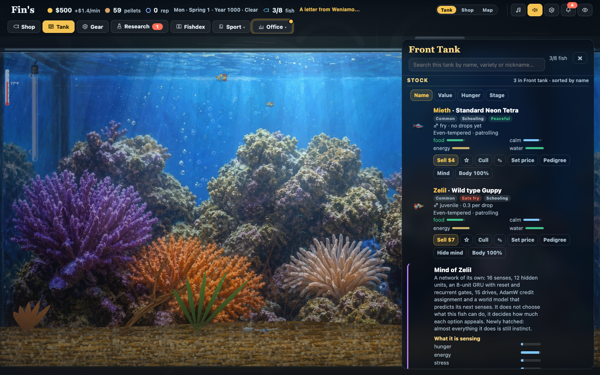
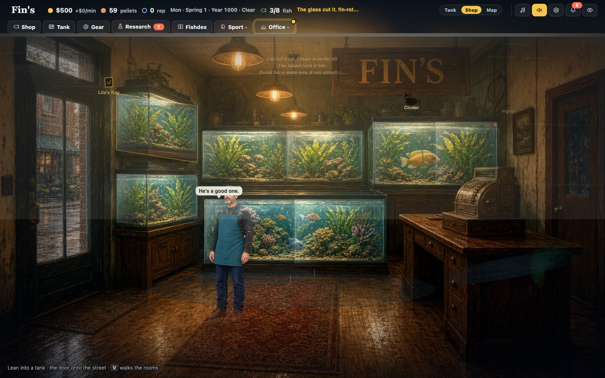
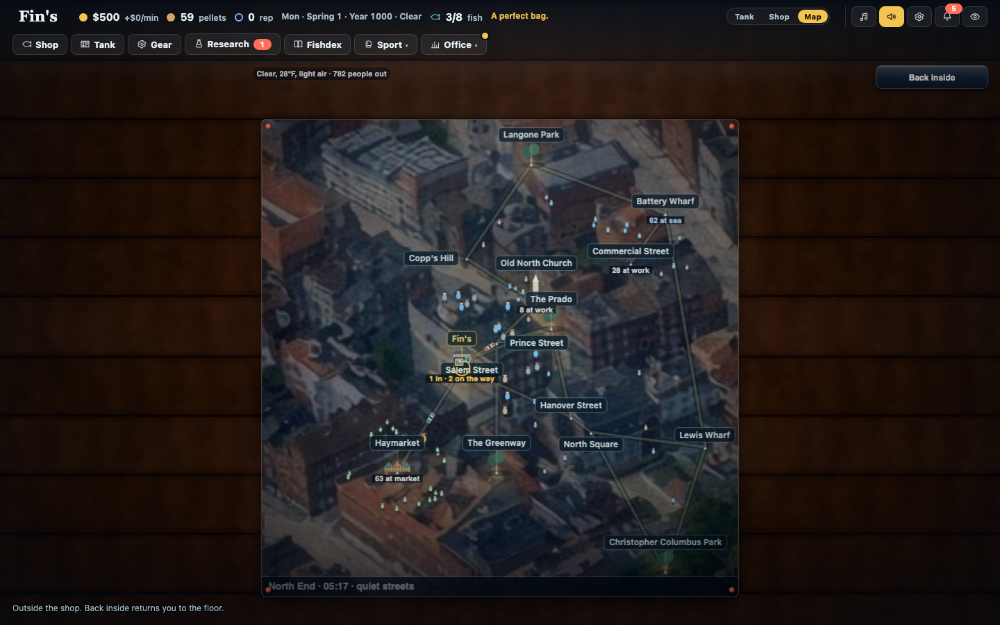
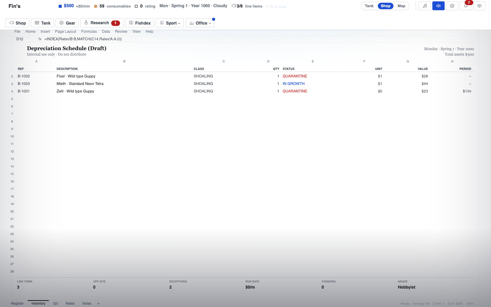
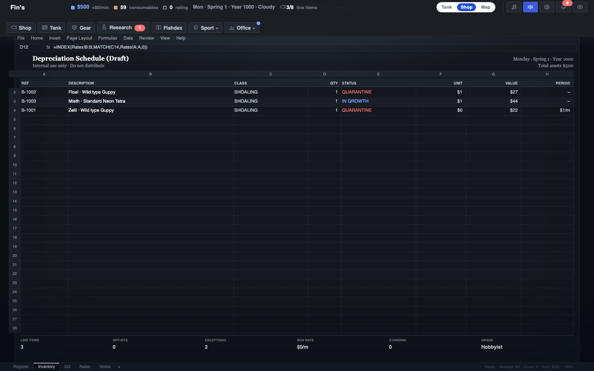
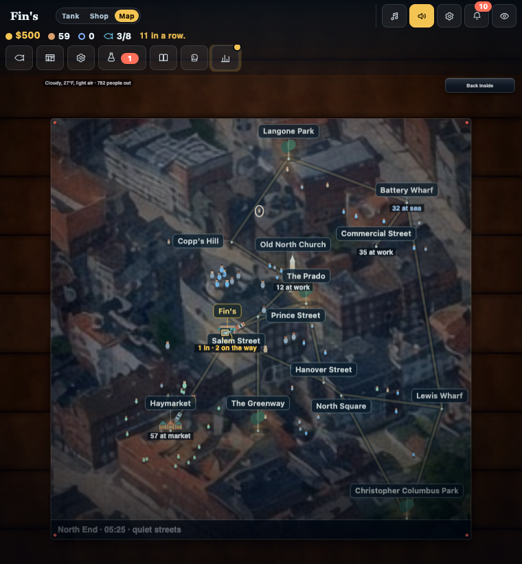
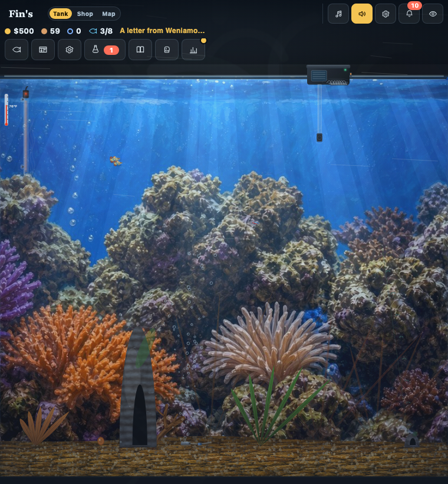
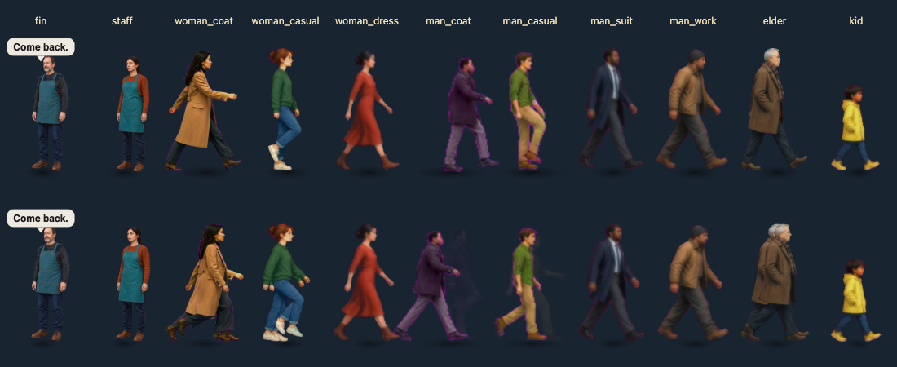

# Screenshots

Captured from the September 29 water, shop and neighborhood build in an isolated local
Chromium session. The three rooms use a 1440 by 900 viewport. External Google Fonts
were blocked to exercise the fallback layout. These are game captures, not concept art.

## The three rooms

## Work Mode

The same save continues behind the operations ledger. Light and dark themes are
shown below.

## Smaller screens and reduced motion

The neighborhood below uses a 760 by 820 viewport. Decorative motion respects
the reduced-motion preference; aquarium simulation continues.

## People

Each of the eleven sheets rendered through the game's actual person renderer,
standing above and moving below. This contact sheet helped catch duplicated frames
and missing clothing before the gallery was captured.

See [the change notes](../polish.md), [map behavior](../town-map.md), and
[remaining work](../next-steps.md). To capture a fresh review, run
`npm run check:polish -- --out work/screenshots` from the repository root.
